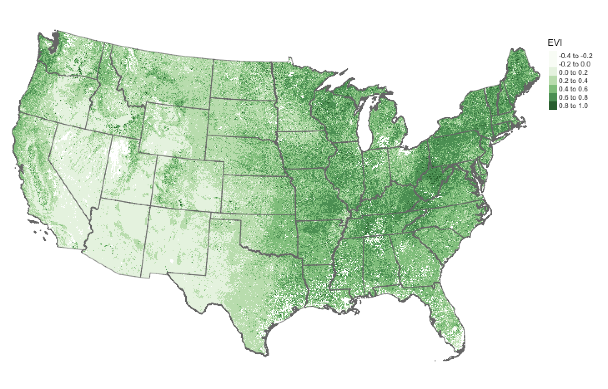

# degauss/pepr_greenspace

> DeGAUSS container that calculates average greenness within 500 m, 1500 m, and 2500 m buffers for PEPR multi-site study

## Enhanced Vegetation Index (EVI)

The Enhanced Vegetation Index (EVI) is a measure of greenness that ranges from -0.2 to 1, with higher values corresponding to more vegetation.

A cloud-free composite EVI raster at a resolution of 250 × 250 m was created by assembling individual images collected via remote sensing between June 10 and June 25, 2018.



Residential greenspace is estimated by averaging EVI values within 500, 1500, and 2500 m of each geocoded address.

## Using

DeGAUSS arguments specific to this container:

- `file_name`: name of a CSV file in the current working directory with columns named `lat` and `lon`

### Example calls (that will work with example file included in repository):

**MacOS**

```
docker run --rm -v "$PWD":/tmp docker.pkg.github.com/cole-brokamp/pepr_greenspace:0.2 my_address_file_geocoded.csv
```

**Microsoft Windows**

```
docker run --rm -v "%cd%":/tmp docker.pkg.github.com/cole-brokamp/pepr_greenspace:0.2 my_address_file_geocoded.csv
```

In the above example call, replace `my_address_file_geocoded.csv` with the name of your geocoded csv file.

Some progress messages will be printed and when complete, the program will save the output as the same name as the input file name, but with `pepr_greenspace` appended, e.g. `my_address_file_geocoded_pepr_greenspace.csv`

## DeGAUSS Details

For detailed documentation on DeGAUSS, including general usage and installation, please see the [DeGAUSS](https://github.com/cole-brokamp/DeGAUSS) README.

This software is part of DeGAUSS and uses its same [license](https://github.com/cole-brokamp/DeGAUSS/blob/master/LICENSE.txt).

**Note about data:** 

To create the EVI raster, individual tiles were downloaded from [LP DAAC](https://lpdaac.usgs.gov/) and combined using the [MODIS](https://github.com/MatMatt/MODIS) R package. Then the raster was clipped and masked to the contiguous United States boundaries.

The raster file needed to run this container can be downloaded [here](https://cchmc.sharepoint.com/:i:/s/GRAPPH/EWBDVmOnRSFKpGHyLQa12aoB11KV9huUZ04bsY8VIRNDcA?e=zHLXnv). 

